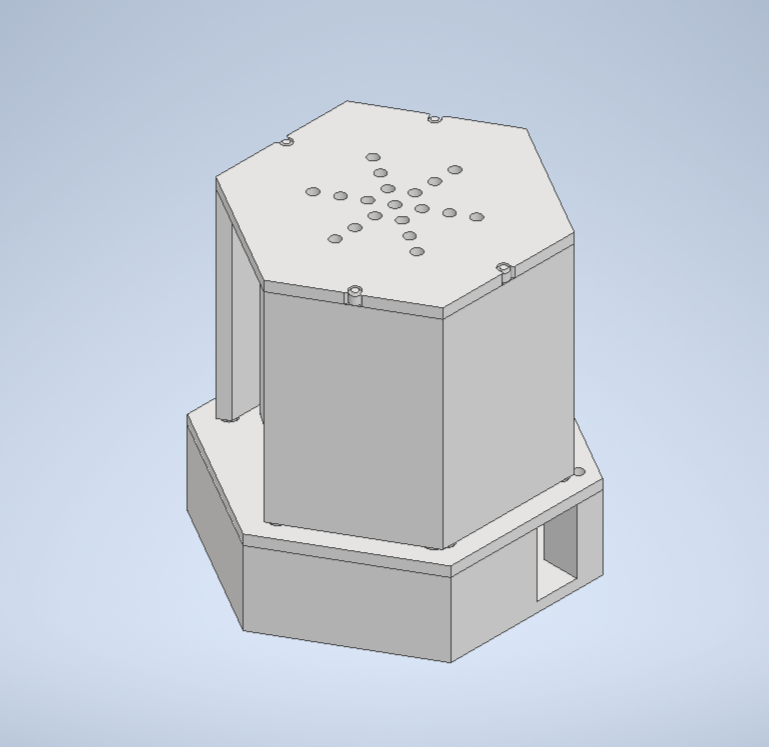

# 뉴스 요약 서비스 앱 & IoT 

요약된 뉴스를 음성과 텍스트로 제공하는 앱 및 IoT 서비스입니다. 

***여러분은 할 일을 하세요. 뉴스는 저희가 읽어드리겠습니다.***

# 📣프로젝트 소개

뉴스를 하나씩 확인할 시간이 없는 당신에게, 

뉴스를 간편하게 듣고 싶은 당신에게

***요약된 뉴스를 텍스트와 음성으로 제공해드려요***

### 주요 사용자

- 일상 속에서 간편하게 최근 뉴스를 알고 싶은 사람들
- 텍스트가 아닌 음성으로 뉴스를 알고 싶은 사람들

### 주요 기능

App

- 카테고리 별 요약된 뉴스 정보 제공
- GPS 기반 현재 위치의 날씨 제공
- 사용자의 나이를 기반으로 인기있는 뉴스 제공
- 현재 이슈가 되고 있는 토픽 제공
- GPS 기반 지역 뉴스 제공
- 뉴스 검색 기능
- 뉴스 좋아요, 스크랩, 공유 기능

Iot

- 카테고리 별 요약된 뉴스 읽기
- 챗봇과의 대화 기능
- 날짜, 검색어를 이용한 뉴스 검색
- 사용자가 설정한 시간에 뉴스를 읽어주는 알람

 

# 📣기능 소개(App) - minuet(미뉴에트)

#### 1. 메인화면
 - 날씨 정보 제공
 - user's pick (사용자 나이 기반 인기있는 뉴스)
 - hot tag(현재 이슈가 되고 있는 키워드)

#### 2. 카테고리 뉴스

- 경제, 사회, 생활, 세계, 과학 분야의 뉴스 제공

- 뉴스 검색 기능

 

- 좋아요, 북마크 기능

- 본문 기사 링크, 공유하기

#### 3. 지역 뉴스

- 부산, 경남, 울산, 인천, 강원 지역 뉴스 제공

#### 4. 오페라 설정 및 알람 설정(IoT)

 

# 📣기능 소개(IoT) - opera(오페라)

# 📣기술 스택

 

# 🐣개발 환경

### **Back-end**
  - Java Version : Zulu JDK 17.44.15
  - SpringBoot Version: 3.2.1
      - spring.dependency-management version: 1.1.4
  - SpringFramework Version: 6.2.1
  - Spring Security: 3.2.1
  - JJWT: 0.11.5
  - Swagger: SpringDoc OpenAPI Starter WebMVC UI 2.3.0
  - Mysql-Server: 8.0.35
  - JUnit: 5
  - MongoDB : 7.0.7

  - spark: 3.2.4
  - python: 3.10.13
  - krwordrank: 1.0.3
  - kiwipiepy: 0.17.0

### **Front-end**
  - nodejs Version: 20.10.0
  - react-native: 0.73.5
  - bootstrap Version: 2.10.0
  - expo: ~50.0.13
  - reduxjs/toolkit: 2.2.1
  - firebase: 10.8.1

### **CI/CD**
  - AWS EC2
  - Jenkins
  - Docker

### 서비스 아키텍처

 

# 🐣프로젝트 일정 및 기타 산출물
### 프로젝트 일정

### [ERD](https://www.erdcloud.com/p/PDYHsnKLT6935ME89)

### [Figma](https://www.figma.com/file/KMKyyDxZWR8mElKw6IRsEg/E205-특화과제?type=design&node-id=513-2&mode=design)

# 👪개발 멤버

|NAME|ROLE|
|------|---|
|🐹박주헌|Front & IoT
|🐫정세진|Front
|🐳이형욱|Back Leader
|⭐️전은희|Back & Team Leader
|🐥최재성|Front Leader
|🐯박예지|Back

